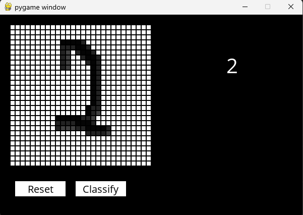

# Digits
Implementation of an AI to classify handwriting digits.

## Usage



Download the distribution code and unzip it.

Once in the directory for the project, run ```pip3 install -r requirements.txt``` to install the required Python package (pygame) and Tensorflow for this project.

Run ```python recognition.py model.h1``` to classify handwriting digits from 0 to 9 using the model trained from ```handwriting.py```.

You can modify the convolutional neural network details that are used inside the ```handwriting.py``` to create a newly trained model by running ```python recognition.py {model name}```.
